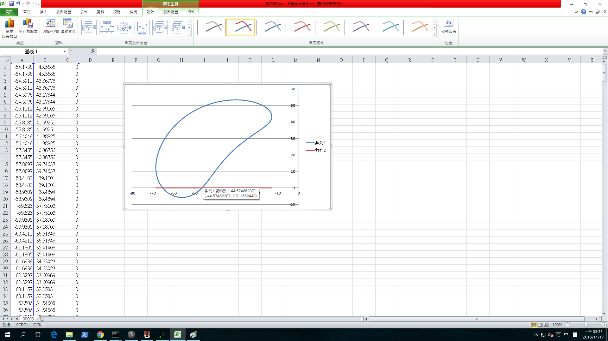
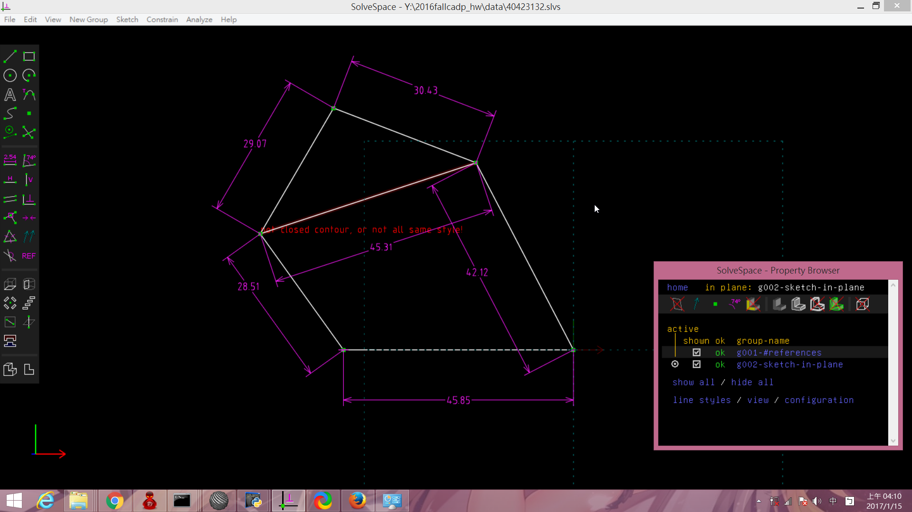

Title: 0112 電腦輔助設計實習課程總結
Date: 2016-10-6 11:00
Category: HW
Tags: 日常
Author: 40423132

<!-- PELICAN_END_SUMMARY -->

###上課筆記

1.下載mini2016fall.7z工具

2.到mdecourse的2016fallCADP點擊fork

3.建立自己的作業倉儲，組長還須建立2016fallcadp_ag8倉儲

4.在倉儲建立gh-pages分支

5.將組別倉儲clone下來，切換到gh-pages分支

6.使用git submodule add -b gh-pages 指令將組員的作業倉儲加入子模組

7.每周定時使用

(1) git submodule init

(2)git submodule update和

(3)git submodule foreach "(git checkout gh-pages; git pull)&"來更新

8.設定shareX的儲存位置

(1)Application settings

(2)path選擇想儲存的位置即可

9.使用solvespace練習繪製零件

###零件繪製

<iframe src="https://player.vimeo.com/video/189897593" width="640" height="345" frameborder="0" webkitallowfullscreen mozallowfullscreen allowfullscreen></iframe>

<a href="https://vimeo.com/189897593">cadpa作業-1</a> from <a href="https://vimeo.com/user47579118">郭力維</a> on <a href="https://vimeo.com">Vimeo</a>.

###四連桿

Solvespace 四連桿圖

<a href="./../w7/w7.csv"> w7.csv</a> (請以滑鼠右鍵存檔)

<a href="./../w7/w7.slvs">w7.slvs</a> (請以滑鼠右鍵存檔)

###四連桿路徑

###組合圖成品 

<iframe src="./../data/1222.html"width="800"height="600"/></iframe>

###3D印表機

零件
<iframe src="./../data/盤子.html"width="800"height="600"/></iframe>
<iframe src="./../data/長棒.html"width="800"height="600"/></iframe>
<iframe src="./../data/短棒.html"width="800"height="600"/></iframe>
<iframe src="./../data/噴嘴.html"width="800"height="600"/></iframe>

完成品

<iframe src="./../data/3DPRT.html"width="800"height="600"/></iframe>

組合影片

<iframe src="https://player.vimeo.com/video/198189954" width="640" height="480" frameborder="0" webkitallowfullscreen mozallowfullscreen allowfullscreen></iframe> 
<a href="https://vimeo.com/198189954">3D印表機-1</a> from <a href="https://vimeo.com/user47579118">郭力維</a> on <a href="https://vimeo.com">Vimeo</a>.

<iframe src="https://player.vimeo.com/video/198189989" width="640" height="480" frameborder="0" webkitallowfullscreen mozallowfullscreen allowfullscreen></iframe> 
<a href="https://vimeo.com/198189989">3D印表機-2</a> from <a href="https://vimeo.com/user47579118">郭力維</a> on <a href="https://vimeo.com">Vimeo</a>.
